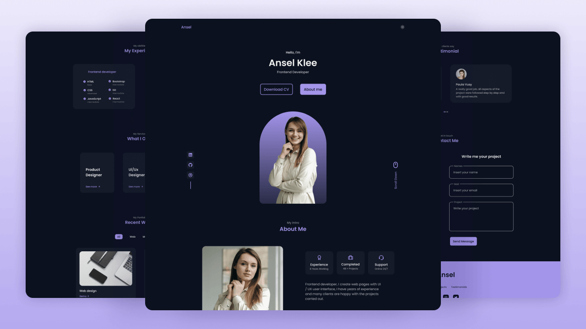

<!--
	Modern README for the responsive-portfolio-website-Ansel project.
	Uses the repository root `preview.png` as the hero image.
-->

# Responsive Portfolio Website — Ansel



A clean, modern and responsive portfolio website template built with semantic HTML, modular SCSS and a touch of JavaScript for interactivity. Ready to use as a personal portfolio, freelancer landing page, or small agency showcase.

## Key features

- Fully responsive layout for desktop, tablet and mobile
- Modular SCSS structure with variables and components
- Smooth scroll and reveal animations (ScrollReveal)
- Filterable portfolio (MixItUp) and testimonial slider (Swiper)
- Minimal, accessible HTML and lightweight JS

## Built with

- HTML5
- SCSS (compiled to CSS)
- Vanilla JavaScript
- Small libraries included: MixItUp, Swiper, ScrollReveal

## Live preview

Open `index.html` in your browser to view the site locally. If you use VS Code, the "Live Server" extension provides a quick way to launch and auto-refresh the site.

### Quick start

1. Clone or download this repository.
2. Open the project folder in your editor.
3. Open `index.html` in your browser or run a local server (recommended).

Example (VS Code Live Server):

```powershell
# Open the project folder in VS Code and start Live Server, or simply open index.html
code .; # then click "Go Live" in VS Code Live Server extension
```

## Folder structure

Important files and folders:

- `index.html` — main entry
- `assets/css/styles.css` — compiled stylesheet
- `assets/scss/` — SCSS source files (components, layout, theme)
- `assets/js/main.js` — custom interactive scripts
- `assets/img/` — site images
- `preview.png` — project preview used in this README
- `pdf/Ansel-Cv.pdf` — example CV included

## Development

If you want to modify styles, edit the SCSS files under `assets/scss/` and recompile to `assets/css/styles.css`. Typical workflow:

1. Edit SCSS in `assets/scss/`
2. Compile SCSS to CSS using your preferred tool (npm script, Dart Sass, or an editor plugin)

Example using Dart Sass (if installed):

```powershell
sass assets/scss/styles.scss assets/css/styles.css --no-source-map --style=compressed
```

Note: This repository includes the compiled CSS so you can open `index.html` without additional build steps.

## Customization ideas

- Replace images and copy to personalize the portfolio
- Add contact form handling or Netlify Forms for submissions
- Integrate a CMS or headless CMS for dynamic content

## Contributing

Contributions are welcome. Open an issue or a pull request with a clear description of your changes.

## License

This project is available under the terms of the license in the `LICENSE` file.

## Author

masifislamm — original template author and repository owner


